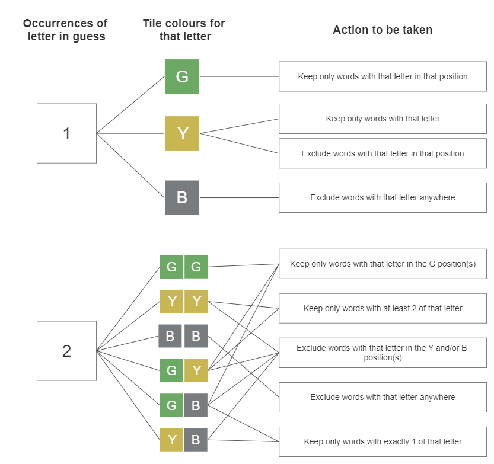
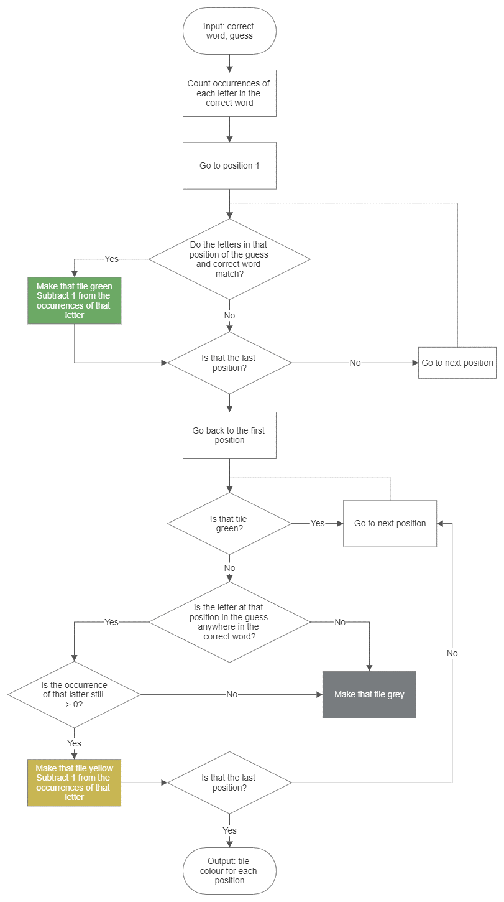

# Wordle-Helper

Wordle-Helper can compare a guess and its corresponding tile colours to exclude words as possible solutions. The remaining list of words can help users decide their next guess.

There is also a solver feature that will run until it finds a given correct word.

All scripts are written in Python.

## How Does Wordle-Helper Work?

Wordle helper compares the guess and corresponding tile colours inputted by the user to exclude words from the list of accepted Wordle words. Initially, it only used the tile colours separately, but was improved to consider all letters of the guess together. For example, without considering the other letters, a grey tile only means you can exclude any words with that letter in that position. If you knew there was only one of that letter in the guess, you could then exclude all words without that letter anywhere as it would otherwise be yellow. The diagram below shows the actions taken by the program for different circumstances:

The Wordle solver also uses a function to work out the tile colours based on the guess and correct word using the algorithm below:

Once certain words have been excluded from the list, a suggestion for the next guess will be made. This is based on letter frequencies. Words are scored by how frequently their letters appear in the full list of words. The 'OrderedWords' files contain words in this order.

## Wordle Helper Usage

The file Wordle_helper.py should be used alongside online Wordle. It asks the user for their guess and the tile colours at each stage of the game.
It will reduce the list of possible words based on this and suggest the next word to guess. The user also has the option of seeing all remaining words.

## Wordle Solver Usage

The file Wordle_solver.py takes the correct word as an input and will make guesses and reduce the list until it solves it.

## Word List

Wordle will accept five letter words from a list of 12953, but the correct word is drawn from a shorter list of 2315. The helper program knows this list and will only use these words as suggestions. It will, however, take any word from the longer list as an input as real Wordle would.

The solver program can be used with two options. You can choose to let it know about the shorter list and give it a correct word to find from this list or it can be made to solve for a word from the longer list.

